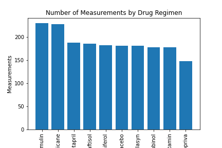
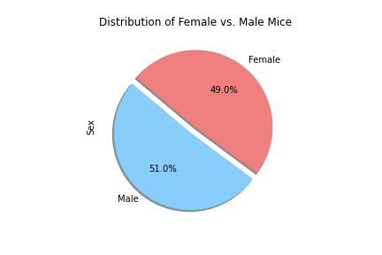
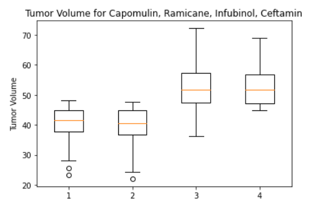

# Drug Treatment vs. Tumor Growth in Mice

## Introduction

The purpose of this study was to compare the performance of a drug treatment of interest, Capomulin, versus the other treatment regimens in regards to tumor growth in mice. From the data given several tables and figures used for analysis were created to form a technical report of the study. 

## Technologies

* Python 3.4
* Pandas
* Matplotlib
* Scipy.stats
* Numpy
* Jupyter Notebook

## Process

* Data cleansing 
* Generate a summary statistics table consisting of the mean, median, variance, standard deviation, and SEM of the tumor volume for each drug regimen.
* Generate a bar plot that shows the total number of measurements taken for each treatment regimen throughout the course of the study.
* Generate a pie plot that shows the distribution of female or male mice in the study.
* Calculate the final tumor volume of each mouse across four of the most promising treatment regimens: Capomulin, Ramicane, Infubinol, and Ceftamin. 
* Calculate the quartiles and IQR and quantitatively determine if there are any potential outliers across all four treatment regimens.
* Generate a box and whisker plot of the final tumor volume for all four treatment regimens and highlight any potential outliers in the plot by changing their color and style.
* Calculate the correlation coefficient and linear regression model between mouse weight and average tumor volume for the Capomulin treatment. Plot the linear regression model on top of the previous scatter plot.

## Visualizations

